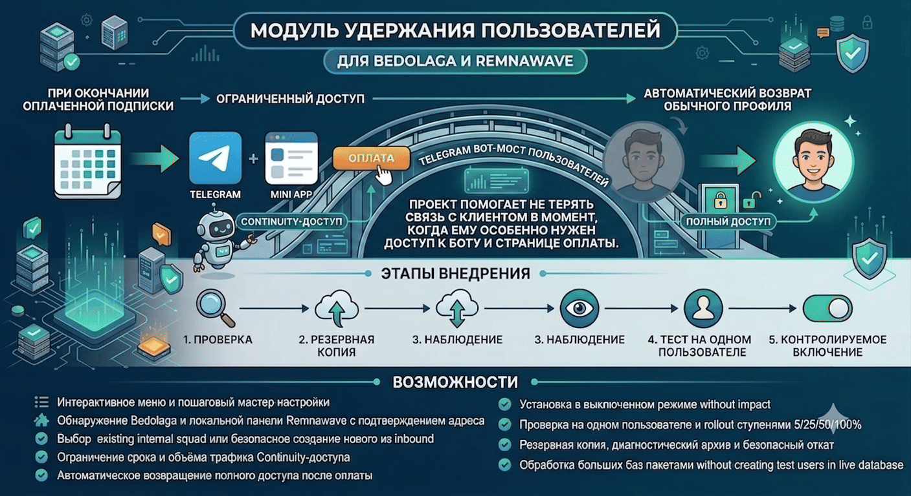

# Bedolaga Continuity


**Подписка закончилась — связь с клиентом остаётся.**

Bedolaga Continuity помогает не терять пользователя в самый неудобный момент. Вместо полного
отключения клиент получает ограниченный доступ: он по-прежнему может открыть Telegram, написать
в поддержку, зайти в Mini App и продлить подписку. После оплаты обычный доступ возвращается
автоматически.

Это готовый сценарий удержания для связки **Bedolaga + Remnawave**: без ручного переключения
профилей, резкого запуска на всей базе и риска остаться без понятного пути назад.

## Зачем это вашему сервису

- **Клиент не остаётся один.** Канал связи, поддержка и Mini App доступны даже после окончания
  подписки.
- **Продлить проще.** Пользователь может сразу перейти к оплате, не ища обходной способ открыть
  сайт или бота.
- **Меньше ручной работы.** После успешной оплаты полный доступ восстанавливается автоматически.
- **Один мастер вместо набора команд.** Он сам выполняет настройку, проверку, резервное копирование,
  тест на одном пользователе и постепенное включение.
- **Есть путь назад.** Перед изменениями создаётся резервная копия, а для диагностики и отката
  предусмотрены отдельные инструменты.

## Как это работает

```text
Подписка активна  → обычный профиль
Подписка истекла  → ограниченный Continuity-профиль
Оплата прошла     → обычный профиль восстановлен
```

Ограниченный профиль, разрешённые сервисы, срок и лимит трафика задаёте вы. Continuity следит за
состоянием подписки и вовремя переключает режим доступа.

### Логика работы



## Что уже входит

- единый автоматический мастер с продолжением с последнего завершённого этапа;
- обнаружение Bedolaga и панели Remnawave с подтверждением выбранного адреса;
- выбор существующего internal squad или создание нового из выбранных inbound;
- настройка срока и объёма ограниченного трафика;
- автоматическое восстановление обычного доступа после оплаты;
- обработка больших баз пакетами без создания тестовых пользователей;
- обезличенная диагностика, резервное копирование и безопасный откат.

Внутри мастер соблюдает безопасный путь внедрения:

```text
preflight → backup → install (disabled) → observe → canary → 5% → 25% → 50% → 100%
```

Администратору не нужно запускать эти команды вручную. Мастер сам переходит между этапами и на
контрольных точках предлагает продолжить, оставить текущую ступень, поставить новые активации на
паузу или выполнить безопасный откат. Ни установка, ни мастер не переходят к массовому включению
без подтверждения успешного теста на одном пользователе.

> Сейчас поддерживается точный upstream-коммит **Bedolaga v3.64.0**. Если версия неизвестна или
> нужные файлы были изменены, установка остановится до любых изменений в рабочей системе.

## Что подготовить

- сервер, **на котором запущен Telegram-бот Bedolaga** — устанавливать Continuity нужно именно там;
- Linux-сервер с Docker и Docker Compose v2;
- установленную Bedolaga v3.64.0;
- URL и API-ключ Remnawave;
- отдельный inbound ограниченного доступа на ноде;
- маршрутизацию к Telegram, Mini App, DNS и оплате на стороне этого inbound/профиля.

Мастер создаёт или выбирает **internal squad**, но не переписывает ваши Xray-профили, хосты и ноды.
Так вы сами определяете, какие сервисы останутся доступны, и можете проверить сетевую политику до
подключения пользователей.

Панель Remnawave может находиться на другом сервере: мастер попробует определить её адрес из
настроек Bedolaga, а если не найдёт — попросит URL и API-ключ. На сервер панели или на VPN-ноду
саму программу устанавливать не нужно.

## Установка

> Устанавливайте Continuity на сервере с Telegram-ботом Bedolaga. Панель Remnawave и VPN-ноды
> могут находиться на других серверах — устанавливать программу на них не нужно.

Скачайте установщик и его контрольную сумму из последнего релиза:

```bash
curl -fsSLO https://github.com/LaRsonOFFai/bedolaga-grace-bridge/releases/latest/download/install.sh
curl -fsSLO https://github.com/LaRsonOFFai/bedolaga-grace-bridge/releases/latest/download/SHA256SUMS
grep ' install.sh$' SHA256SUMS | sha256sum -c -
less install.sh
sudo bash install.sh
```

Команды нужно выполнять на сервере с ботом Bedolaga. Установщик сразу запускает единый мастер,
который сам проводит настройку, read-only проверку, резервное копирование, установку и безопасное
включение. Если мастер был закрыт, он продолжит с сохранённого этапа:

```bash
sudo gracectl wizard
```

Главное меню доступно командой:

```bash
sudo gracectl
```

Для диагностики, автоматизации и опытных администраторов отдельные команды сохранены:

```bash
sudo gracectl configure
sudo gracectl wizard
sudo gracectl preflight
sudo gracectl install
sudo gracectl observe
sudo gracectl canary
sudo gracectl approve-canary
sudo gracectl activate
sudo gracectl pause
sudo gracectl resume
sudo gracectl status
sudo gracectl bundle
sudo gracectl rollback
sudo gracebridge-rescue
```

Подробности: [установка](docs/installation.md), [архитектура](docs/architecture.md),
[безопасный откат](docs/recovery.md), [совместимость](docs/compatibility.md) и
[проверка на 40 000 записей](docs/load-testing.md).

## Поддержать автора

Bedolaga Continuity развивается как независимый проект. Поддержка помогает уделять больше времени
совместимости с новыми версиями, тестированию и улучшению мастера установки.

- **USDT — Arbitrum One:** `0xab888dff209bb7874ce3602f869e6957ceec2dbe`
- **BTC:** `bc1qwe73vkhc89hevt4sqy608v7gcyk3ldgmj020de`

Перед отправкой обязательно проверьте адрес и сеть. USDT принимается только в сети
**Arbitrum One**; перевод через другую сеть может быть потерян.

## Статус проекта

Bedolaga Continuity — независимый проект и не является официальным компонентом Bedolaga или
Remnawave. Условия лицензирования и сведения о производных compatibility-файлах приведены в
[NOTICE](NOTICE) и [LICENSE](LICENSE).
